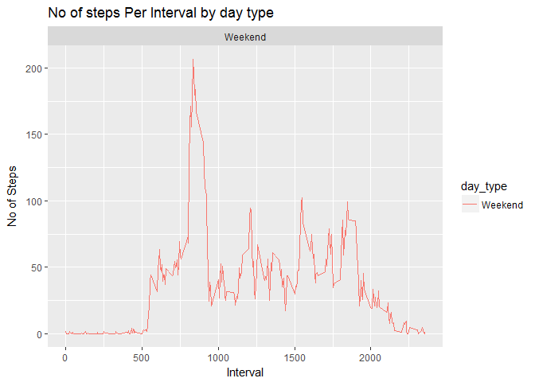

# Reproducible Research: Peer Assessment 1


## Loading and preprocessing the data


### Introduction:
This assignment makes use of data from a personal activity monitoring device. This device collects data at 5 minute intervals through out the day. The data consists of two months of data from an anonymous individual collected during the months of October and November, 2012 and include the number of steps taken in 5 minute intervals each day.

The data for this assignment can be downloaded from the course web site:

**Dataset:** Activity monitoring data [52K] The variables included in this dataset are:  
**steps:** Number of steps taking in a 5-minute interval (missing values are coded as NA)  
**date:** The date on which the measurement was taken in YYYY-MM-DD   format  
**interval**: Identifier for the 5-minute interval in which measurement was taken

The dataset is stored in a comma-separated-value (CSV) file and there are a total of 17,568 observations in this dataset.


```r
# Load the packages needed for coding:
library("dplyr")
```

```
## Warning: package 'dplyr' was built under R version 3.3.3
```

```
## 
## Attaching package: 'dplyr'
```

```
## The following objects are masked from 'package:stats':
## 
##     filter, lag
```

```
## The following objects are masked from 'package:base':
## 
##     intersect, setdiff, setequal, union
```

```r
library("ggplot2")
library("lattice")
```

#### Load the data:


```r
# The dataset is loaded from a csv file by "read.csv" command and stored in "activity":
activity<- read.csv("activity.csv", header=TRUE)

# see the dimension:
dim(activity)
```

```
## [1] 17568     3
```


```r
# See the file's content:
head(activity)
```

```
##   steps      date interval
## 1    NA 10/1/2012        0
## 2    NA 10/1/2012        5
## 3    NA 10/1/2012       10
## 4    NA 10/1/2012       15
## 5    NA 10/1/2012       20
## 6    NA 10/1/2012       25
```


## What is mean total number of steps taken per day?
1. Calculate the total number of steps taken per day:

```r
# Aggregate the total number of steps taken per day based on date and stored in "activity_step_day". 
# Also, the NAs are removed by "na.rm" command.
activity_step_day<- aggregate(steps ~ date, activity, sum, na.rm=TRUE)
```

2. Make a histogram of the total number of steps taken each day:

```r
# Making a histogram by "hist" command.
hist(activity_step_day$steps, main="Histogram of Total Number of Steps per Day", xlab="Steps per Day", ylab="Frequency", col="grey")
```

<!-- -->

3. Calculate and report the mean and median of the total number of steps taken per day:

```r
# Mean and Median are obtained by "summary" command.
summary(activity_step_day)
```

```
##          date        steps      
##  10/10/2012: 1   Min.   :   41  
##  10/11/2012: 1   1st Qu.: 8841  
##  10/12/2012: 1   Median :10765  
##  10/13/2012: 1   Mean   :10766  
##  10/14/2012: 1   3rd Qu.:13294  
##  10/15/2012: 1   Max.   :21194  
##  (Other)   :47
```

*As can be seen from the result, Mean of the total number of steps taken per day is **10766** and the Median is **10765***.


## What is the average daily activity pattern?

1. Make a time series plot (i.e. type = "l") of the 5-minute interval (x-axis) and the average number of steps taken, averaged across all days (y-axis)


```r
# Aggregating the data from activity dataset for average no. of steps per 5-min interval.
avg_steps_interval<- aggregate(steps ~ interval, activity, mean, na.rm=TRUE)
head(avg_steps_interval)
```

```
##   interval     steps
## 1        0 1.7169811
## 2        5 0.3396226
## 3       10 0.1320755
## 4       15 0.1509434
## 5       20 0.0754717
## 6       25 2.0943396
```

```r
# Plot the average steps per intervals.
plot(avg_steps_interval$interval, avg_steps_interval$steps, type="l", col="black", main="Average Daily Activity", xlab="Time Intervals", ylab="Average no. of Steps")
```

<!-- -->

2. Which 5-minute interval, on average across all the days in the dataset, contains the maximum number of steps?


```r
# Maximum no. of steps taken.
interval_max_steps<- which.max(avg_steps_interval$steps)
print(avg_steps_interval[interval_max_steps, ]$steps)
```

```
## [1] 206.1698
```

```r
# The interval that maximum no. of steps taken.
print(avg_steps_interval[interval_max_steps, ]$interval)
```

```
## [1] 835
```

*Based on the data extracted from dataset, the maximum number of steps  was **206.1698** taken at interval **835** *.


## Imputing missing values

1. Calculate and report the total number of missing values in the dataset (i.e. the total number of rows with NAs)
Devise a strategy for filling in all of the missing values in the dataset. The strategy does not need to be sophisticated. For example, you could use the mean/median for that day, or the mean for that 5-minute interval, etc.


```r
# Number of rows that have missing values by "complete.cases" command on the dataset.
missing_NA<- activity[!complete.cases(activity), ]
nrow(missing_NA)
```

```
## [1] 2304
```

2. Create a new dataset that is equal to the original dataset but with the missing data filled in.


```r
# The strategy here is to replace the missing NAs values with the average of steps taken in that interval all day long.
for(i in 1:nrow(activity)) {
      if(is.na(activity$steps[i])) {
      val<- avg_steps_interval$steps[which(avg_steps_interval$interval == activity$interval[i])]
activity$steps[i]<- val
      }
}
```

3. Make a histogram of the total number of steps taken each day and Calculate and report the mean and median total number of steps taken per day. Do these values differ from the estimates from the first part of the assignment? What is the impact of imputing missing data on the estimates of the total daily number of steps?

```r
# Histogram of total no. oc steps taken each day.
steps_day_impute<- aggregate(steps ~ date, activity, sum)
hist(steps_day_impute$steps, main="Histogram of Total Number of Steps per Day(Imputed)", xlab="Steps per Day", ylab="Frequency", col="grey")
```

<!-- -->

```r
# Mean total no. of steps taken per day.
mean(steps_day_impute$steps)
```

```
## [1] 10766.19
```

```r
# Median total no. of steps taken per day.
median(mean(steps_day_impute$steps))
```

```
## [1] 10766.19
```
***No significant changes has been observed** for the Mean and Median of the steps taken per day as the result of imputing missing data.*


## Are there differences in activity patterns between weekdays and weekends?


1. Create a new factor variable in the dataset with two levels ??? ???weekday??? and ???weekend??? indicating whether a given date is a weekday or weekend day.


```r
week_day <- function(date_val) {
    wd <- weekdays(as.Date(date_val, '%Y-%m-%d'))
    if  (!is.na(wd == 'Saturday' || wd == 'Sunday')) {
        x <- 'Weekday'
    } else {
        x <- 'Weekend'
    }
    x
}
```

2. Make a panel plot containing a time series plot (i.e. type = "l") of the 5-minute interval (x-axis) and the average number of steps taken, averaged across all weekday days or weekend days (y-axis). See the README file in the GitHub repository to see an example of what this plot should look like using simulated data.


```r
#load the ggplot library.
library("ggplot2")
library(lattice)

# Apply the week_day function and add a new column to activity dataset.
activity$day_type <- as.factor(sapply(activity$date, week_day))


# Aggregate the dataframe by intervals and day_type.
steps_per_day_impute <- aggregate(steps~ interval+day_type, activity, mean)

# Create the plot.
par(mfrow=c(2,1))
ggplot(steps_per_day_impute, aes(interval, steps)) +
    geom_line(stat = "identity", aes(col=day_type)) +
    theme_gray() +
    facet_wrap(~day_type, nrow=2) +
    labs(x="Interval", y=expression("No of Steps")) +
    ggtitle("No of steps Per Interval by day type")
```

<!-- -->

*It seems that the number of steps taken on **weekends** are less than that taken in **weekdays** at the later intervals.*
